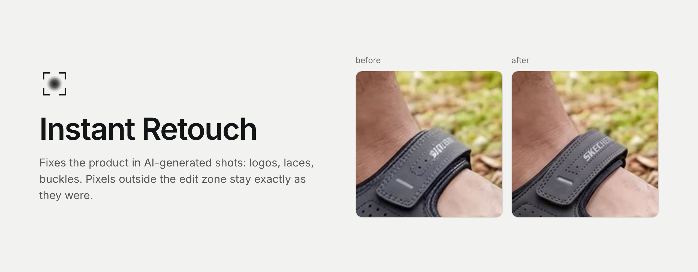
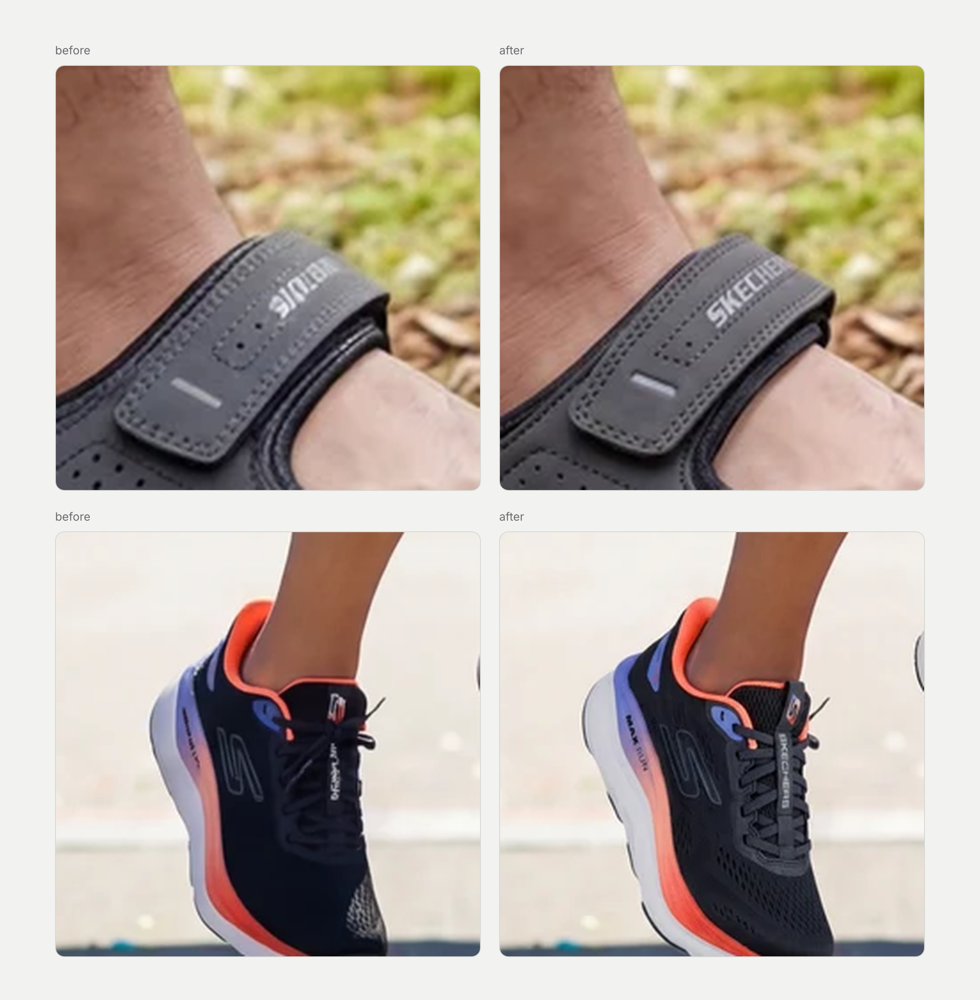

Mark a zone, the model redraws only that zone, the patch goes back to the same pixels.

### modes

| | |
|---|---|
| template | product shots from client PSD templates |
| scratch | new scene with the product from a prompt and references |
| retouch | redraw a marked zone on a finished shot |
| batch | a full set of shots from folders in one run |

### Stack

| | |
|---|---|
| UI | React, TypeScript, Vite |
| server | Netlify Functions |
| patch and color | sharp |
| storage | Supabase, Cloudflare R2 |
| models | fal.ai, OpenRouter, Anthropic |

Source code is private.
